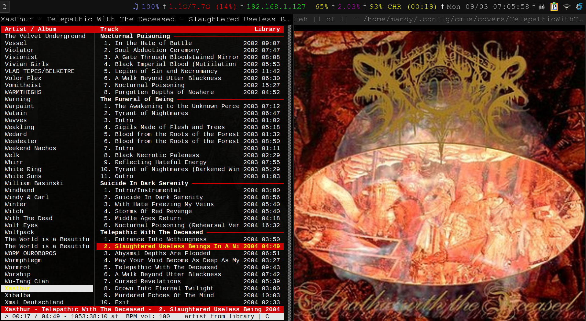

# cmus-artwork
displays album artwork from cmus using feh

## Steps:

1. Add `cmus_cover_art.py` to your `status_display_program.sh` file
2. Make `cmusart.sh` executable
3. Configure the repo-directory in `cmus_cover_art.py` and `cmusart.sh` appropriately
4. (optional) Make an alias for `cmusart.sh` in your `.bashrc`
5. Call your alias or the `cmusart.sh` script in the background like so: `cmusart &`
6. Start cmus normally and your art should update as it plays

## TODO:

* BUG: no artwork crashes feh, workaround is already in place by restarting feh with default art
